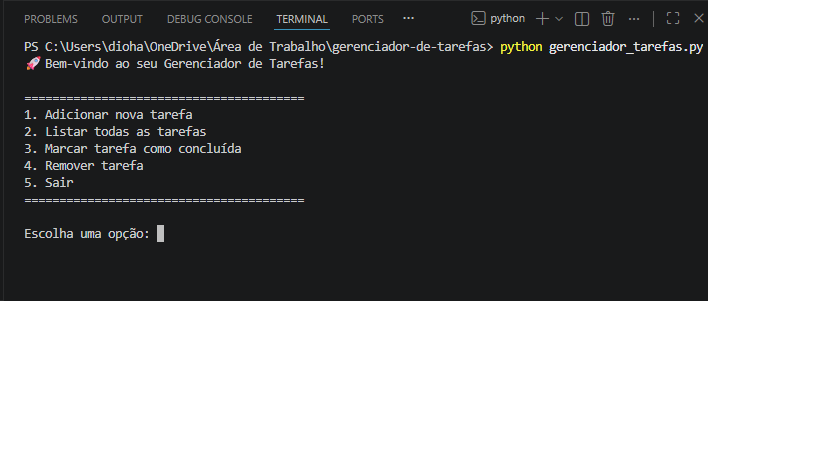

# Gerenciador de Tarefas em Python

Um gerenciador de tarefas simples feito no terminal, desenvolvido como meu primeiro projeto público em Python.  
Ideal para praticar listas, dicionários, arquivos JSON e menu interativo.

<div align="center">
  
  <br>
  <em>Demonstração do Gerenciador de Tarefas em ação</em>
</div>


## Funcionalidades
- Adicionar novas tarefas
- Listar todas as tarefas (com status concluído ou pendente)
- Marcar tarefa como concluída
- Remover tarefa
- Salvamento automático em arquivo JSON (as tarefas não somem ao fechar o programa)

## Tecnologias usadas
- Python 3
- Módulos nativos: `json`, `os`

## Como executar
1. Certifique-se de ter Python instalado (versão 3.6+):  
   [Baixe aqui](https://www.python.org/downloads/) se necessário.
2. Clone ou baixe este repositório:
   ```bash
   git clone https://github.com/massucattokauan-oss/gerenciador-de-tarefas.git
